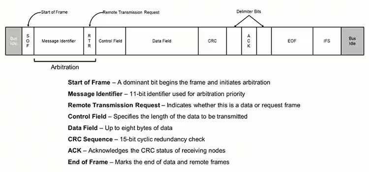

```
The CAN bus follows a standardized protocol that allows the network to address data and commands where needed.  
``` 

```
Between transmissions, the bus is in an idle state at the recessive voltage level. The start of the transmission frame (SOF) is marked by the transmission of a dominant bit. A message identifier in the next field is followed by a remote transmission request (RTR)—which indicates whether the frame contains data or is requesting data. These two fields are used to establish message priority and arbitrate access to the bus. The Control Field contains the length of the following data field. The data field can have up to eight data bytes in classic CAN. If data is being transmitted (data frame), then the data field is followed by the cyclic redundancy check (CRC) which is used to check for transmission errors. At this point, the driver puts the bus into a recessive state so the receiver can acknowledge (ACK) successful receipt by asserting a dominant state. The ACK bit is surrounded by delimiter bits on each side. After the ACK bit, the controller sends a seven-bit end-of-frame (EOF) message followed by a seven-bit interframe spacing, marking the minimum time before another frame can be transmitted. If the bit sequence contains five or more bits of the same state, then the controller will insert a stuff bit of the opposite state to ensure that there are sufficient edges in the signal to maintain synchronization. These stuff bits are removed by the receiver so that the data content is correct. After the CRC field, bit stuffing is deactivated to ensure that the ACK and EOF fields do not show stuff bits.
```
The Basics of the Controller Area Network (CAN bus) and its Use in Automotive Applications
In DigiKey. Retrieved August 6, 2024, from 
https://www.digikey.jp/ja/blog/the-basics-of-the-controller-area-network
