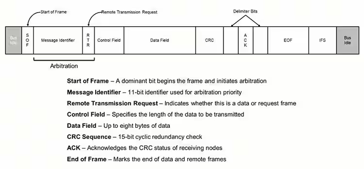

```
CANバスは、ネットワークが必要に応じてデータとコマンドをアドレス指定できる標準化されたプロトコルに従います。
```

```
送信と送信の間、バスはリセッシブ電圧レベルでアイドル状態になります。
送信フレームの開始(SOF)は、ドミナント ビットの送信によってマークされます。
次のフィールドのメッセージ識別子の後には、フレームにデータが含まれているか、またはデータを要求しているかを示すリモート送信要求(RTR)が続きます。
これら2つのフィールドは、メッセージの優先順位を確立し、バスへのアクセスを調停するために使用されます。
制御フィールドには、次のデータフィールドの長さが含まれます。
クラシックCANでは、データ フィールドには最大8つのデータバイトを含めることができます。
データが送信されている場合(データフレーム)、データフィールドの後には、送信エラーをチェックするために使用される巡回冗長検査(CRC)が続きます。
この時点で、ドライバーはバスをリセッシブ状態にして、レシーバーがドミナント状態をアサートして正常に受信したことを確認(ACK)できるようにします。
ACKビットは、両側に区切りビットで囲まれています。
ACKビットの後、コントローラは7ビットのフレーム終了(EOF)メッセージを送信し、その後に7ビットのフレーム間スペースを送信して、次のフレームを送信できるまでの最小時間を示します。
ビットシーケンスに同じ状態のビットが5つ以上含まれている場合、コントローラは反対の状態のスタッフビットを挿入して、信号に同期を維持するのに十分なエッジがあることを確認します。
これらのスタッフビットは、データの内容が正しいように、受信側によって削除されます。
CRCフィールドの後、ビットスタッフィングは非アクティブ化され、ACK フィールドとEOFフィールドにスタッフビットが表示されないようにします。
```
The Basics of the Controller Area Network (CAN bus) and its Use in Automotive Applications
In DigiKey. Retrieved August 6, 2024, from 
https://www.digikey.jp/ja/blog/the-basics-of-the-controller-area-network