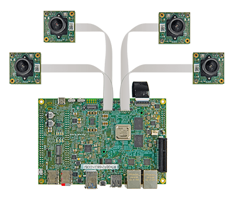

e-CAM22_CURZHは、1/2.8インチのSony Starvis IMX462 CMOSイメージセンサーを搭載したFHDのカスタムレンズカメラモジュールです。これはUYVY画像フォーマットをサポートするカラーカメラであり、Sマウント（M12ボードレンズとも呼ばれる）レンズホルダーが付属しています。
e-CAM22_CURZH は、Renesas RZ/V2H 開発キットのコネクタ (CN23 ～ CN26) のいずれか 1 つに接続できます。 e-CAM22_CURZHは、優れた近赤外線性能を備えており、このカメラの高感度は、0 ルクスのような非常に低い照明条件でも画像を撮影するのに役立ち、暗視アプリケーションや医療顕微鏡に適しています。

#### 特徴

* Sマウントレンズホルダー付FHD Sony Starvisカメラモジュール搭載
* 超低照度性能
* Renesas RZ/V2H開発キットに直接接続
* オンボードの高性能 ISP
* Multicamera support for RZ/V2H (upto 4 cameras)

